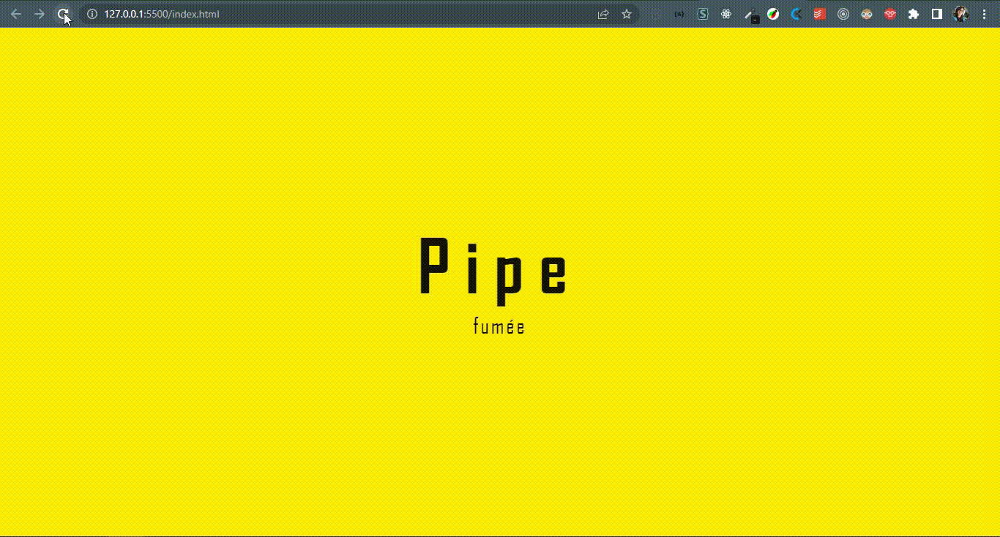

# Ceci n'est pas une pipe 
 
 

<blockquote align="center">“A chave para transformação é a continuidade. Continue a codar!!!”</blockquote>

 

 
 

## Sumário

- [Apresentação](#apresentação)
- [Sobre o Projeto](#sobre-o-projeto)
- [Tecnologias utilizadas](#tecnologias-utilizadas)

 

# Apresentação

 

  

 

## Sobre o Projeto

 

Ceci n'est pas une pipe é um projeto simples feito com HTML, CSS e Javascript.
Seu objetivo central é aprender e experimentar como as ferramentas de animação funcionam em uma landing page.

Neste projeto foi utilizada a GSAP, ou Greensock Animation API, que é uma biblioteca JS que tem capacidade de criar animações de alta performance somada a uma API amigável e de tamanho bem reduzido

 

## Tecnologias Utilizadas

 

<code></code>
<code></code>
<code></code>

 
 

 
 

<h3 align="center">
    
</h3>